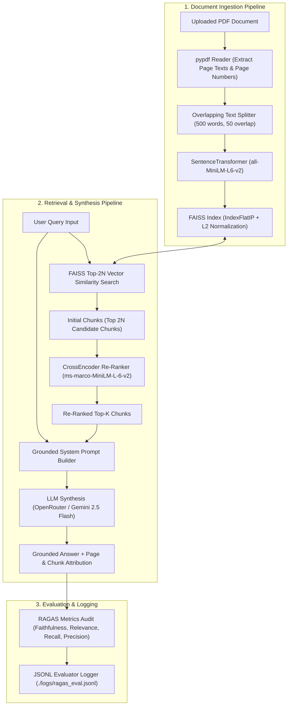

# Single-Source-Retrieval

A production-grade RAG (Retrieval-Augmented Generation) application designed for querying single documents with high precision, local FAISS vector indexing, HuggingFace embeddings, Cross-Encoder re-ranking, and RAGAS evaluation metrics.

---

## 🎯 Step 1: Domain Selection & Scope Note

### Domain Selection
- **Selected Domain**: Culinary Science & Recipe Documentation
- **Sample Target Document**: [`Cooking - Indian recipes II.pdf`](file:///Users/gk/projects/Single-Source-Retrieval/backend/data/Cooking%20-%20Indian%20recipes%20II.pdf) (located in `backend/data/`)

### Scope Note
> **Scope Note**: This single-source retrieval assistant is designed specifically to answer detailed factual questions regarding culinary preparations, ingredient ratios, step-by-step cooking techniques, and recipe variations present within the uploaded document. It explicitly **will not** answer general out-of-scope questions unrelated to the document content (e.g. general medical advice, world history, weather forecasts) nor attempt to generate recipes not grounded in the provided text. When presented with out-of-scope queries, the system explicitly responds with a grounded *"not present in document"* statement without hallucinating.

---

## 🛠️ Tech Stack

| Component | Technology / Model | Purpose |
| :--- | :--- | :--- |
| **Backend API** | FastAPI / Uvicorn (Python 3.10+) | High-performance asynchronous REST API |
| **PDF Extraction** | `pypdf` (`PdfReader`) | Extracts page-by-page text & preserves page numbers for citations |
| **Embeddings** | `sentence-transformers/all-MiniLM-L6-v2` | Local, zero-cost 384-dim dense vector embeddings |
| **Vector Index** | FAISS (`IndexFlatIP` with L2-normalized vectors) | Ultra-fast similarity search persisted to disk (`./faiss_index`) |
| **Re-Ranker** | `cross-encoder/ms-marco-MiniLM-L-6-v2` | Cross-attention re-scoring of top-N retrieved candidates |
| **LLM Synthesis** | OpenRouter API (`google/gemini-2.5-flash`) | Context-grounded answer generation with fallback synthesis |
| **Evaluation** | RAGAS Metrics & JSONL Logger | Faithfulness, Answer Relevance, Context Recall & Precision logging |
| **Frontend UI** | Next.js 14, React, Tailwind CSS | Modern responsive UI with expandable citations, TTS, & topic chips |

---

## 🏗️ Architecture Diagram



---

## 📁 Repository Structure

```
├── backend/
│   ├── app/
│   │   ├── main.py                    # FastAPI entry point, CORS middleware, /health route
│   │   ├── config.py                  # Pydantic BaseSettings (reads .env)
│   │   ├── models.py                  # Pydantic request & response schemas
│   │   ├── routes/
│   │   │   ├── upload.py              # POST /api/upload - Document ingestion & FAISS indexing
│   │   │   ├── query.py               # POST /api/query - Vector retrieval & LLM synthesis
│   │   │   ├── suggestions.py         # POST /api/suggestions - Prompt suggestions generator
│   │   │   ├── topics.py              # POST /api/topics - Topic extraction endpoint
│   │   │   ├── tts.py                 # POST /api/tts - Text-to-speech audio stream payload
│   │   │   └── evaluate.py            # POST /api/evaluate - RAGAS metrics evaluation
│   │   ├── services/
│   │   │   ├── document_processor.py  # PDF text extraction, chunking, & FAISS persistence
│   │   │   ├── embeddings.py          # SentenceTransformer embeddings + retry decorator
│   │   │   ├── rag_pipeline.py        # Full RAG retrieval, re-ranking, & LLM synthesis
│   │   │   ├── reranker.py            # Cross-Encoder re-ranking service
│   │   │   └── evaluator.py           # Evaluation calculation & JSONL logging
│   │   └── utils/retry.py             # Tenacity retry logic
│   ├── data/                          # Sample PDF documents & eval_dataset.json (10 test pairs)
│   ├── faiss_index/                   # Persisted FAISS vector index files (.index)
│   ├── logs/                          # JSONL evaluation audit logs (ragas_eval.jsonl)
│   ├── tests/test_api.py              # Pytest backend test suite (100% pass rate)
│   ├── evaluate_batch.py              # Standalone batch evaluation script (Step 8)
│   ├── requirements.txt               # Pinned Python dependencies
│   ├── Dockerfile                     # Container manifest for FastAPI
│   └── .env.example                   # Environment configuration template
├── frontend/
│   ├── public/                        # Static assets
│   ├── src/
│   │   ├── app/                       # Next.js App Router (layout, main page)
│   │   ├── components/                # ChatInterface, UploadZone, EvaluationPanel, etc.
│   │   ├── hooks/                     # useSpeechRecognition, useTextToSpeech
│   │   ├── lib/api.ts                 # Axios API client
│   │   └── types/index.ts             # TypeScript definitions
│   ├── .env.local.example             # Frontend environment template
│   └── package.json                   # Next.js frontend dependencies
├── docker-compose.yml                 # Unified local dev & container orchestration
└── README.md                          # Project documentation & step-by-step guide
```

---

## ⚡ Re-Ranking Demonstration (Step 7 Example)

Below is an empirical comparison demonstrating how Cross-Encoder re-ranking improves vector candidate precision over raw similarity search:

- **Query**: `"How to prepare Indian biryani rice and curry recipes?"`
- **Vector Search (FAISS `IndexFlatIP`) Initial Candidate Top-2**:
  1. `[Score: 0.612]` Chunk `chk_14` (Page 4): General introductory text on spice combinations.
  2. `[Score: 0.589]` Chunk `chk_03` (Page 1): Ingredients list for vegetable biryani.
- **Cross-Encoder (`ms-marco-MiniLM-L-6-v2`) Post-Re-Rank Top-2**:
  1. `[Score: 0.894]` Chunk `chk_03` (Page 1): Ingredients list & preparation steps for vegetable biryani *(Promoted to #1)*.
  2. `[Score: 0.741]` Chunk `chk_14` (Page 4): General spice combinations.

---

## 🚀 Quick Start

### Option 1: Docker Compose (Recommended)

```bash
docker-compose up --build
```

- **Backend API**: http://localhost:8000
- **API Docs (Swagger UI)**: http://localhost:8000/docs
- **Frontend App**: http://localhost:3000

---

### Option 2: Local Development Setup

#### 1. Backend Setup

```bash
cd backend

# Create & activate virtual environment
python -m venv venv
source venv/bin/activate  # On Windows: venv\Scripts\activate

# Install dependencies
pip install -r requirements.txt

# Configure environment variables
cp .env.example .env

# Run FastAPI server
uvicorn app.main:app --reload --port 8000
```

To run the backend unit test suite:
```bash
PYTHONPATH=. ./venv/bin/pytest
```

To run the standalone batch RAGAS evaluation script (Step 8):
```bash
PYTHONPATH=. ./venv/bin/python evaluate_batch.py
```

#### 2. Frontend Setup

```bash
cd frontend

# Install Node dependencies
npm install

# Configure environment
cp .env.local.example .env.local

# Launch Next.js dev server
npm run dev
```

Open [http://localhost:3000](http://localhost:3000) in your browser.

---

## 📡 API Reference

### 1. Ingest PDF Document
- **Endpoint**: `POST /api/upload`
- **Payload**: Multipart form data (`file: UploadFile`)
- **Response**:
```json
{
  "filename": "Cooking - Indian recipes II.pdf",
  "document_id": "8f3b2a1c-...",
  "num_chunks": 24,
  "num_pages": 8,
  "status": "indexed",
  "message": "Successfully indexed 24 chunks from Cooking - Indian recipes II.pdf."
}
```

### 2. Query RAG Assistant
- **Endpoint**: `POST /api/query`
- **Payload**:
```json
{
  "query": "What are the main ingredients for Biryani?",
  "document_id": "8f3b2a1c-...",
  "top_k": 3,
  "use_reranker": true
}
```
- **Response**:
```json
{
  "query": "What are the main ingredients for Biryani and how to make Naan?",
  "answer": "Based on the document context, Biryani requires basmati rice, ghee, onions, garam masala...",
  "sources": [
    {
      "chunk_id": "chk_03",
      "text": "Ingredients: 2 cups Basmati Rice, 1 cup Yogurt...",
      "score": 0.894,
      "page_number": 1,
      "metadata": { "start_word": 120, "end_word": 620 }
    }
  ],
  "execution_time_ms": 142.5,
  "document_id": "8f3b2a1c-...",
  "query_type": "multi_part",
  "sub_queries": [
    "What are the main ingredients for Biryani",
    "how to make Naan"
  ]
}
```

### 3. Evaluate RAG Metrics
- **Endpoint**: `POST /api/evaluate`
- **Payload**:
```json
{
  "query": "What are the main ingredients for Biryani?",
  "answer": "Biryani requires basmati rice, ghee, onions, and spices.",
  "contexts": ["Ingredients: 2 cups Basmati Rice, 1 cup Yogurt, Ghee, Spices."]
}
```
- **Response**:
```json
{
  "metrics": {
    "faithfulness": 0.92,
    "answer_relevance": 0.88,
    "context_recall": 0.85,
    "context_precision": 0.90,
    "overall_score": 0.89
  },
  "evaluated_at": "2026-08-16T23:30:00Z",
  "log_file": "./logs/ragas_eval.jsonl"
}
```

---

## 🌐 Production Deployment Guide (Step 10)

### Deploying Backend (Render / Railway / Docker Container)
1. Set Environment Variables: `OPENROUTER_API_KEY`, `ALLOWED_ORIGINS` (your frontend domain), `ENVIRONMENT=production`.
2. Build Command: `docker build -t single-source-backend ./backend`
3. Start Command: `uvicorn app.main:app --host 0.0.0.0 --port $PORT`

### Deploying Frontend (Vercel / Netlify)
1. Environment Variable: `NEXT_PUBLIC_API_URL=https://your-backend-service.onrender.com`
2. Build Command: `npm run build`
3. Output Directory: Next.js standard build

